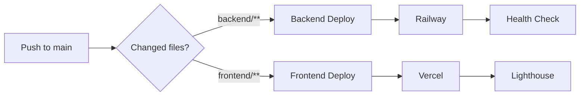
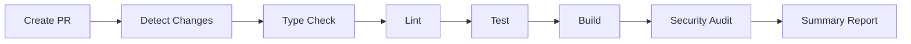

# 🚀 Deployment Configuration Summary

Complete CI/CD pipeline configured for TastyFund project.

## ✅ What's Been Configured

### 1. GitHub Actions Workflows (3 files)

#### **Backend Deploy** (`.github/workflows/backend-deploy.yml`)
- Triggers on push to `main` with backend changes
- Runs tests, linting, type checking
- Builds Docker image
- Deploys to Railway
- Runs database migrations
- Performs health checks

#### **Frontend Deploy** (`.github/workflows/frontend-deploy.yml`)
- Triggers on push to `main` with frontend changes
- Runs tests, linting, type checking, Prettier
- Builds Next.js application
- Deploys to Vercel
- Auto-updates Railway CORS origin
- Runs Lighthouse performance tests

#### **PR Checks** (`.github/workflows/pr-checks.yml`)
- Triggers on all pull requests
- Smart path detection (only checks changed code)
- Type checking, linting, tests
- Build verification
- Security audit (npm audit)
- Bundle size monitoring
- Automated summary reports

---

### 2. Vercel Configuration

#### **vercel.json** (Frontend)
```json
{
  "buildCommand": "npm run build",
  "outputDirectory": ".next",
  "devCommand": "npm run dev",
  "installCommand": "npm install",
  "framework": "nextjs",
  "regions": ["icn1"],  // Seoul region
  "env": {
    "NEXT_PUBLIC_API_URL": "@backend_url"
  }
}
```

#### **next.config.mjs** (Enhanced)
- Image optimization for Railway, Unsplash, placeholders
- API rewrites for development (proxy to backend)
- Environment-specific configurations
- Production optimizations (console removal)
- Remote pattern support for dynamic domains

---

### 3. Package Scripts

#### **Backend** (`backend/package.json`)
```json
{
  "scripts": {
    "dev": "nodemon src/index.ts",
    "build": "tsc",
    "start": "node dist/index.js",
    "lint": "tsc --noEmit",
    "test": "echo \"No tests yet\" && exit 0"
  }
}
```

#### **Frontend** (`frontend/package.json`)
```json
{
  "scripts": {
    "dev": "next dev",
    "build": "next build",
    "start": "next start",
    "lint": "next lint",
    "format:check": "prettier --check \"**/*.{js,jsx,ts,tsx,json,css,md}\"",
    "format": "prettier --write \"**/*.{js,jsx,ts,tsx,json,css,md}\"",
    "test": "echo \"No tests yet\" && exit 0",
    "deploy:preview": "vercel",
    "deploy:production": "vercel --prod"
  }
}
```

---

### 4. Code Quality Tools

#### **Prettier** (Frontend)
- Configuration: `.prettierrc.json`
- Ignore patterns: `.prettierignore`
- Integrated into CI/CD pipeline

---

### 5. Documentation

| File | Purpose |
|------|---------|
| `CI_CD_SETUP.md` | Quick reference guide |
| `.github/SECRETS_SETUP.md` | Secrets configuration guide |
| `.github/workflows/README.md` | Workflows documentation |
| `.github/DEPLOYMENT_SUMMARY.md` | This file |
| `frontend/.env.example` | Environment variables template |

---

## 🔑 Required GitHub Secrets

Set these in: **Repository → Settings → Secrets and variables → Actions**

| Secret | Purpose | How to Get |
|--------|---------|------------|
| `RAILWAY_TOKEN` | Backend deployment | `railway whoami --token` |
| `DATABASE_URL` | Database migrations | `railway variables` |
| `VERCEL_TOKEN` | Frontend deployment | [vercel.com/account/tokens](https://vercel.com/account/tokens) |
| `VERCEL_ORG_ID` | Vercel organization | `cat frontend/.vercel/project.json` |
| `VERCEL_PROJECT_ID` | Vercel project | `cat frontend/.vercel/project.json` |

---

## 🎯 Deployment Flow

### Automatic Deployments



### Pull Request Flow



---

## 📊 Features

### ✅ Automated Testing
- TypeScript type checking
- ESLint linting
- Prettier formatting checks
- Unit tests (when added)
- Build verification

### ✅ Automated Deployment
- Railway (Backend)
- Vercel (Frontend)
- Database migrations
- CORS auto-update

### ✅ Performance Monitoring
- Lighthouse CI tests
- Bundle size tracking
- Build time monitoring

### ✅ Security
- npm audit on every PR
- Secrets management
- No credentials in code
- Branch protection ready

### ✅ Developer Experience
- Fast feedback on PRs
- Automated summaries
- Manual deployment options
- Local testing scripts

---

## 🚀 Getting Started

### 1. One-Time Setup (5 minutes)

```bash
# Install Vercel CLI
npm install -g vercel

# Link Vercel project
cd frontend
vercel login
vercel link

# Get Vercel IDs
cat .vercel/project.json

# Get Railway token
railway login
railway whoami --token

# Get database URL
railway variables | grep DATABASE_URL
```

### 2. Configure GitHub Secrets

Add all 5 secrets listed above to your GitHub repository.

### 3. Install Dependencies

```bash
# Frontend (includes Prettier)
cd frontend
npm install

# Backend
cd backend
npm install
```

### 4. Push to GitHub

```bash
git add .
git commit -m "ci: add complete CI/CD pipeline"
git push origin main
```

### 5. Monitor First Deployment

- Go to GitHub Actions tab
- Watch workflows execute
- Check deployment logs
- Verify apps are accessible

---

## 🧪 Testing the Setup

### Test Backend Deployment
```bash
echo "// test backend" >> backend/src/index.ts
git add backend/
git commit -m "test: backend deployment"
git push origin main
```

### Test Frontend Deployment
```bash
echo "// test frontend" >> frontend/app/page.tsx
git add frontend/
git commit -m "test: frontend deployment"
git push origin main
```

### Test PR Checks
```bash
git checkout -b feature/test-pr
echo "// test" >> backend/src/index.ts
git add .
git commit -m "feat: test PR checks"
git push origin feature/test-pr
# Create PR on GitHub
```

---

## 📈 Expected Results

### After Setup
- ✅ All workflows appear in Actions tab
- ✅ Secrets are configured
- ✅ Vercel project is linked
- ✅ Railway project is linked

### After First Push
- ✅ Workflows trigger automatically
- ✅ Tests and linting pass
- ✅ Builds complete successfully
- ✅ Deployments succeed
- ✅ Apps are accessible

### After First PR
- ✅ PR checks run automatically
- ✅ Status checks appear on PR
- ✅ Summary report is generated
- ✅ All checks pass

---

## 🔧 Maintenance

### Regular Tasks
- Rotate tokens every 90 days
- Review and update dependencies
- Monitor build times
- Check Lighthouse scores
- Review security audit results

### When Adding Features
- Add tests for new code
- Update workflows if needed
- Test locally before pushing
- Create PR for review

---

## 📞 Support Resources

### Documentation
- [GitHub Actions Docs](https://docs.github.com/en/actions)
- [Railway Docs](https://docs.railway.app)
- [Vercel Docs](https://vercel.com/docs)
- [Lighthouse CI Docs](https://github.com/GoogleChrome/lighthouse-ci)

### Project Files
- `CI_CD_SETUP.md` - Quick reference
- `.github/SECRETS_SETUP.md` - Secrets guide
- `.github/workflows/README.md` - Workflows guide

### Troubleshooting
1. Check workflow logs in Actions tab
2. Verify secrets are set correctly
3. Test CLI commands locally
4. Review Railway/Vercel logs
5. Check service status pages

---

## 🎉 Success Checklist

- [ ] All GitHub secrets configured
- [ ] Vercel project linked
- [ ] Railway project linked
- [ ] Dependencies installed
- [ ] Workflows pushed to GitHub
- [ ] First deployment successful
- [ ] Backend accessible at Railway URL
- [ ] Frontend accessible at Vercel URL
- [ ] PR checks working
- [ ] Lighthouse tests passing

---

## 🚀 You're All Set!

Your CI/CD pipeline is ready. Every push to `main` will automatically deploy your changes, and every PR will be thoroughly checked before merging.

**Happy deploying!** 🎊
